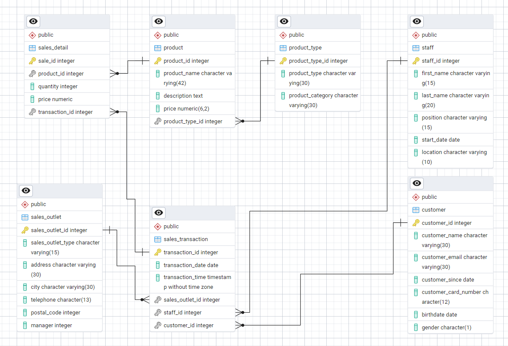

# Coffee Shop Database Project

## **Overview**

This is the **final lab project** for the **Introduction to Relational Databases (RDBMS)** course on **Coursera**, offered by IBM. The goal of this project is to design and implement a relational database system for a fictional coffee shop chain expanding nationally. 

As part of the project, a comprehensive database infrastructure was created to centralize data from various sources and improve operational efficiency. Additionally, views and materialized views were created to enable executives to make data-driven decisions efficiently.

The project demonstrates database design, implementation, and querying skills using PostgreSQL and MySQL.

---

## **Scenario**

The coffee shop chain operates multiple franchise locations. Currently, their data resides in disparate systems:
- Accounting software
- Supplier databases
- Point of Sales (POS) systems
- Spreadsheets

The aim is to consolidate this scattered data into a single relational database, ensuring:
- Improved operational efficiency
- Streamlined decision-making
- Easier reporting capabilities

As a database designer, I worked to:
1. Identify entities and attributes.
2. Create an Entity-Relationship Diagram (ERD) to model relationships.
3. Normalize tables and define keys.
4. Load data into the database and create views.
5. Export data for use in MySQL and provide SQL scripts for reproducibility.

---

## **Project Objectives**

By completing this project, I achieved the following objectives:
- Identified entities and attributes for the coffee shop's database.
- Designed an ERD using pgAdmin's ERD tool and generated SQL scripts.
- Normalized tables to minimize redundancy and ensure data integrity.
- Created database objects (tables) in PostgreSQL and MySQL.
- Developed and exported views and materialized views to meet business requirements.
- Imported CSV data into MySQL using scripts and GUI tools.
- Exported query outputs from PostgreSQL for further analysis.

---

## **Directory Structure**

### **1. `erd/`**
- **Contents**:
  - The Entity-Relationship Diagram (ERD) as an image file (`erd/ERD2.png`).
  - PostgreSQL ERD files for table creation.

### **2. `data/`**
- **Contents**:
  - Description of entities and their attributes (`erd/README.md`).
  - Sample data photo showcasing the input datasets (`data/sample_data.png`).
  - SQL script from course materials for recreating the database schema.

### **3. `exports/`**
- **Contents**:
  - Query outputs exported as CSV files.
  - Views exported:
    - `product_info_m_view.csv`
    - `staff_locations_view.csv`

### **4. `sql_scripts/`**
- **Contents**:
  - SQL scripts generated from the ERD in PostgreSQL.
  - A MySQL script for creating tables for importing CSV files and exploring the tables.

### **5. `views/`**
- **Contents**:
  - SQL scripts for creating views:
    - Regular view: `create_product_info_m_view.sql`
    - Materialized view: `create_staff_locations_view.sql`

---

## **Tools and Technologies Used**
- **PostgreSQL**: For designing the database, creating tables, and exporting query results.
- **MySQL**: For importing data and recreating views.
- **pgAdmin**: For creating the ERD.
- **SQL**: Used to generate scripts for table creation, queries, and views.

---

## **How to Reproduce the Project**

1. **Setup PostgreSQL**:
   - Run the SQL script `generated_script_ERD_course` from the `sql_scripts/` folder in your PostgreSQL database.
   - Load data as per the sample data in the `data/` folder. Use `CoffeeData.sql`.

2. **Create Views**:
   - Use the scripts in the `views/` folder to create views in PostgreSQL.

3. **Export Data**:
   - Export the data using the PostgreSQL query outputs (`exports/` folder).

4. **Recreate Database in MySQL**:
   - Use the MySQL script from the `sql_scripts/` folder to recreate the tables.
   - Import the exported CSV files using MySQL or phpMyAdmin.

---

## **Acknowledgment**
This project was completed as part of the **Introduction to Relational Databases (RDBMS)** course on **Coursera**, offered by IBM. Special thanks to the course instructors for providing the foundational knowledge and sample data for this project.

---
